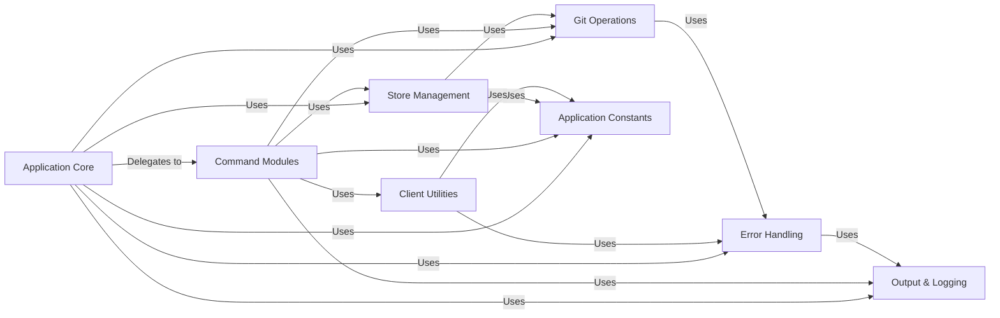

## Component Details

The `Application Core` serves as the central orchestrator and command dispatcher for the `pre-commit` command-line interface. It is responsible for parsing command-line arguments, setting up the application's execution environment, and directing control to the appropriate sub-commands for processing. This component acts as the primary control flow manager, ensuring that user requests are correctly interpreted and executed.

### Application Core

The primary entry point and command dispatcher for the `pre-commit` CLI. It parses command-line arguments, initializes the application environment, and orchestrates the execution of various sub-commands.

**Related Classes/Methods**:

- <a href="https://github.com/pre-commit/pre-commit/blob/master/pre_commit/main.py#L196-L437" target="_blank" rel="noopener noreferrer">`pre_commit.main` (196:437)</a>

### Command Modules

A collection of modules, each implementing a specific `pre-commit` command (e.g., `run`, `install`, `autoupdate`). These modules encapsulate the distinct business logic for individual CLI operations.

**Related Classes/Methods**:

- `pre_commit.commands` (1:1)

### Store Management

Manages the persistent storage and caching of pre-commit repositories and their associated data (e.g., cloned repositories, hook environments), ensuring efficient access and data integrity.

**Related Classes/Methods**:

- <a href="https://github.com/pre-commit/pre-commit/blob/master/pre_commit/store.py#L1-L1" target="_blank" rel="noopener noreferrer">`pre_commit.store` (1:1)</a>

### Client Utilities

Provides shared client-side logic and utilities, including configuration parsing, migration strategies, and general helper functions used across various commands.

**Related Classes/Methods**:

- <a href="https://github.com/pre-commit/pre-commit/blob/master/pre_commit/clientlib.py#L1-L1" target="_blank" rel="noopener noreferrer">`pre_commit.clientlib` (1:1)</a>

### Git Operations

Encapsulates functionalities for interacting with Git repositories, such as checking the Git environment, executing Git commands, and managing repository states.

**Related Classes/Methods**:

- <a href="https://github.com/pre-commit/pre-commit/blob/master/pre_commit/git.py#L1-L1" target="_blank" rel="noopener noreferrer">`pre_commit.git` (1:1)</a>

### Output & Logging

Responsible for managing all console output, including colored text, progress indicators, and logging messages, to provide clear and informative feedback to the user.

**Related Classes/Methods**:

- <a href="https://github.com/pre-commit/pre-commit/blob/master/pre_commit/output.py#L1-L1" target="_blank" rel="noopener noreferrer">`pre_commit.output` (1:1)</a>

- <a href="https://github.com/pre-commit/pre-commit/blob/master/pre_commit/color.py#L1-L1" target="_blank" rel="noopener noreferrer">`pre_commit.color` (1:1)</a>

- <a href="https://github.com/pre-commit/pre-commit/blob/master/pre_commit/logging_handler.py#L34-L41" target="_blank" rel="noopener noreferrer">`pre_commit.logging_handler` (34:41)</a>

### Error Handling

Defines custom exception types and provides a centralized mechanism for handling and reporting errors gracefully, ensuring robust application behavior and a better user experience.

**Related Classes/Methods**:

- <a href="https://github.com/pre-commit/pre-commit/blob/master/pre_commit/errors.py#L1-L1" target="_blank" rel="noopener noreferrer">`pre_commit.errors` (1:1)</a>

- <a href="https://github.com/pre-commit/pre-commit/blob/master/pre_commit/error_handler.py#L70-L80" target="_blank" rel="noopener noreferrer">`pre_commit.error_handler` (70:80)</a>

### Application Constants

Stores immutable constants and configuration values used globally throughout the application, such as version numbers, default paths, and magic strings.

**Related Classes/Methods**:

- <a href="https://github.com/pre-commit/pre-commit/blob/master/pre_commit/constants.py#L1-L1" target="_blank" rel="noopener noreferrer">`pre_commit.constants` (1:1)</a>

### [FAQ](https://github.com/CodeBoarding/GeneratedOnBoardings/tree/main?tab=readme-ov-file#faq)