```mermaid

graph LR

    Configuration_Schema_Validation["Configuration Schema & Validation"]

    YAML_Parser["YAML Parser"]

    YAML_Rewriter["YAML Rewriter"]

    Repository_Store["Repository Store"]

    Repository_Management["Repository Management"]

    Configuration_Schema_Validation -- "defines expectations for" --> YAML_Parser

    Configuration_Schema_Validation -- "sends validated data to" --> YAML_Rewriter

    YAML_Parser -- "parses for" --> Configuration_Schema_Validation

    YAML_Parser -- "provides structure to" --> YAML_Rewriter

    YAML_Rewriter -- "uses" --> YAML_Parser

    Repository_Store -- "provides path to" --> Repository_Management

    Repository_Store -- "manages lifecycle of repositories for" --> Repository_Management

    Repository_Management -- "requests and stores repositories in" --> Repository_Store

    Repository_Management -- "provides manifest data to" --> Configuration_Schema_Validation

    click Repository_Management href "https://github.com/pre-commit/pre-commit/blob/main/.codeboarding//Repository_Management.md" "Details"

```

## Component Details

This component is central to how `pre-commit` manages its operational parameters and the external code repositories it interacts with. It ensures that the application's behavior is consistent, validated, and efficiently handles the lifecycle of cached repositories.

### Configuration Schema & Validation

Defines and validates the structure and content of the `.pre-commit-config.yaml` and `manifest.yaml` files. It includes checks for hook definitions, language types, and pre-commit version compatibility. It also handles the migration of deprecated stage names.

**Related Classes/Methods**:

- <a href="https://github.com/pre-commit/pre-commit/blob/master/pre_commit/clientlib.py#L1-L1" target="_blank" rel="noopener noreferrer">`pre_commit.clientlib` (1:1)</a>

### YAML Parser

Provides robust functionality for loading and dumping YAML data, specifically tailored for `pre-commit`'s configuration files. It handles various YAML-related operations, including safe loading and error handling during parsing.

**Related Classes/Methods**:

- <a href="https://github.com/pre-commit/pre-commit/blob/master/pre_commit/yaml.py#L1-L1" target="_blank" rel="noopener noreferrer">`pre_commit.yaml` (1:1)</a>

### YAML Rewriter

Facilitates in-place modifications and updates to YAML files, particularly the `.pre-commit-config.yaml`. This is essential for operations like `autoupdate` or `migrate-config`, allowing `pre-commit` to programmatically adjust the user's configuration while preserving comments and formatting.

**Related Classes/Methods**:

- <a href="https://github.com/pre-commit/pre-commit/blob/master/pre_commit/yaml_rewrite.py#L1-L1" target="_blank" rel="noopener noreferrer">`pre_commit.yaml_rewrite` (1:1)</a>

### Repository Store

Manages the local cache of pre-commit repositories. This includes operations for initializing, cloning, and retrieving repositories, as well as garbage collection to manage disk space. It acts as a persistent storage mechanism for the cloned repositories.

**Related Classes/Methods**:

- <a href="https://github.com/pre-commit/pre-commit/blob/master/pre_commit/store.py#L1-L1" target="_blank" rel="noopener noreferrer">`pre_commit.store` (1:1)</a>

### Repository Management

Encapsulates the logic for interacting with individual pre-commit repositories. This includes cloning, checking out specific revisions, and managing the repository's internal state and manifest. It bridges the gap between the abstract concept of a repository and its physical representation on disk.

**Related Classes/Methods**:

- <a href="https://github.com/pre-commit/pre-commit/blob/master/pre_commit/repository.py#L1-L1" target="_blank" rel="noopener noreferrer">`pre_commit.repository` (1:1)</a>

### [FAQ](https://github.com/CodeBoarding/GeneratedOnBoardings/tree/main?tab=readme-ov-file#faq)