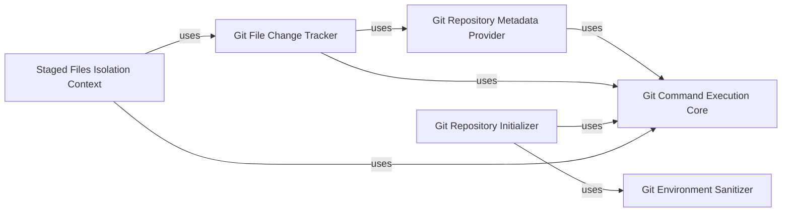

## Component Details

The `Git Integration Layer` in `pre-commit` provides a robust and high-level interface for interacting with the Git version control system. It is designed to abstract away the complexities of direct Git command-line interactions, offering a set of focused components that handle various aspects of Git operations, from repository information retrieval to managing the Git index for hook execution. This layer is fundamental to `pre-commit`'s ability to reliably execute hooks against the correct set of files and maintain repository integrity.

### Git Command Execution Core

This is the foundational component responsible for executing all Git commands and handling their output. It abstracts away the direct interaction with the `git` executable, providing a reliable and consistent way for other components to run Git operations. It's fundamental because all Git-related functionalities within `pre-commit` ultimately rely on executing these underlying Git commands.

**Related Classes/Methods**:

- <a href="https://github.com/pre-commit/pre-commit/blob/master/pre_commit/git.py#L1-L1" target="_blank" rel="noopener noreferrer">`pre_commit.git:cmd_output` (1:1)</a>

- <a href="https://github.com/pre-commit/pre-commit/blob/master/pre_commit/git.py#L1-L1" target="_blank" rel="noopener noreferrer">`pre_commit.git:cmd_output_b` (1:1)</a>

### Git Repository Metadata Provider

This component provides essential information about the Git repository's structure and state. It includes functions like `get_root` to determine the repository's top-level directory, `get_git_dir` to locate the `.git` directory, and `is_in_merge_conflict` to check for ongoing merge conflicts. This component is fundamental for navigating the repository and understanding its current operational context.

**Related Classes/Methods**:

- <a href="https://github.com/pre-commit/pre-commit/blob/master/pre_commit/git.py#L50-L72" target="_blank" rel="noopener noreferrer">`pre_commit.git:get_root` (50:72)</a>

- <a href="https://github.com/pre-commit/pre-commit/blob/master/pre_commit/git.py#L75-L82" target="_blank" rel="noopener noreferrer">`pre_commit.git:get_git_dir` (75:82)</a>

- <a href="https://github.com/pre-commit/pre-commit/blob/master/pre_commit/git.py#L95-L100" target="_blank" rel="noopener noreferrer">`pre_commit.git:is_in_merge_conflict` (95:100)</a>

### Git File Change Tracker

This component is dedicated to identifying and listing files based on their status within the Git repository. It offers functionalities suchs as `get_staged_files` to retrieve files currently in the staging area, `get_all_files` for all tracked files, and `get_changed_files` to list differences between revisions. This is crucial for `pre-commit` hooks to accurately determine which files they need to process.

**Related Classes/Methods**:

- <a href="https://github.com/pre-commit/pre-commit/blob/master/pre_commit/git.py#L134-L142" target="_blank" rel="noopener noreferrer">`pre_commit.git:get_staged_files` (134:142)</a>

- <a href="https://github.com/pre-commit/pre-commit/blob/master/pre_commit/git.py#L153-L154" target="_blank" rel="noopener noreferrer">`pre_commit.git:get_all_files` (153:154)</a>

- <a href="https://github.com/pre-commit/pre-commit/blob/master/pre_commit/git.py#L157-L166" target="_blank" rel="noopener noreferrer">`pre_commit.git:get_changed_files` (157:166)</a>

### Git Environment Sanitizer

Represented by the `no_git_env` function, this component is responsible for cleaning and sanitizing the environment variables before executing Git commands or hooks. It filters out potentially problematic `GIT_` prefixed environment variables that could interfere with Git's behavior, ensuring a consistent and isolated execution context. This is fundamental for the robustness and predictability of `pre-commit`'s operations.

**Related Classes/Methods**:

- <a href="https://github.com/pre-commit/pre-commit/blob/master/pre_commit/git.py#L26-L47" target="_blank" rel="noopener noreferrer">`pre_commit.git:no_git_env` (26:47)</a>

### Git Repository Initializer

This component, primarily through the `init_repo` function, handles the creation and initial setup of new Git repositories, including adding remote origins. It's fundamental for internal testing, bootstrapping new `pre-commit` configurations, or setting up temporary repositories.

**Related Classes/Methods**:

- <a href="https://github.com/pre-commit/pre-commit/blob/master/pre_commit/git.py#L184-L192" target="_blank" rel="noopener noreferrer">`pre_commit.git:init_repo` (184:192)</a>

### Staged Files Isolation Context

This component, embodied by the `staged_files_only` context manager, is critical for `pre-commit`'s core behavior. It temporarily modifies the Git working directory and index to ensure that pre-commit hooks only operate on files that are actually staged for the current commit. This prevents hooks from running on irrelevant unstaged modifications and maintains the integrity of the commit process. It's fundamental for the correctness and efficiency of hook execution.

**Related Classes/Methods**:

- <a href="https://github.com/pre-commit/pre-commit/blob/master/pre_commit/staged_files_only.py#L107-L112" target="_blank" rel="noopener noreferrer">`pre_commit.staged_files_only:staged_files_only` (107:112)</a>

### [FAQ](https://github.com/CodeBoarding/GeneratedOnBoardings/tree/main?tab=readme-ov-file#faq)