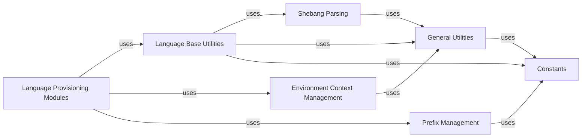

## Component Details

The Hook Environment Provisioning subsystem is crucial for `pre-commit`'s ability to run hooks reliably and in isolation across various programming languages. It ensures that each hook operates within a clean, self-contained environment, preventing conflicts and ensuring consistent execution regardless of the user's local system setup.

### Language Provisioning Modules

These are the individual modules (e.g., `python.py`, `node.py`, `docker.py`) responsible for the concrete implementation of environment setup, dependency installation, and execution context preparation for hooks written in their respective languages. They orchestrate the use of other core provisioning components to achieve language-specific isolation.

**Related Classes/Methods**:

- <a href="https://github.com/pre-commit/pre-commit/blob/master/pre_commit/languages/python.py#L1-L1" target="_blank" rel="noopener noreferrer">`pre_commit.languages.python` (1:1)</a>

- <a href="https://github.com/pre-commit/pre-commit/blob/master/pre_commit/languages/node.py#L1-L1" target="_blank" rel="noopener noreferrer">`pre_commit.languages.node` (1:1)</a>

- <a href="https://github.com/pre-commit/pre-commit/blob/master/pre_commit/languages/docker.py#L1-L1" target="_blank" rel="noopener noreferrer">`pre_commit.languages.docker` (1:1)</a>

### Language Base Utilities

Provides foundational, language-agnostic utilities and base functions commonly used by the language-specific modules. This includes functions for managing environment directories, setting up commands, and interacting with the file system, ensuring a consistent approach to environment management across different languages. It defines the common interface and shared logic for language provisioning.

**Related Classes/Methods**:

- <a href="https://github.com/pre-commit/pre-commit/blob/master/pre_commit/lang_base.py#L1-L1" target="_blank" rel="noopener noreferrer">`pre_commit.lang_base` (1:1)</a>

### Environment Context Management

This module is solely responsible for managing and manipulating environment variables. It sets up the correct execution context for language-specific tools and hooks by ensuring that necessary environment variables (e.g., `PATH` modifications) are correctly configured to locate executables and dependencies within the isolated environment.

**Related Classes/Methods**:

- <a href="https://github.com/pre-commit/pre-commit/blob/master/pre_commit/envcontext.py#L32-L61" target="_blank" rel="noopener noreferrer">`pre_commit.envcontext` (32:61)</a>

### Shebang Parsing

This module handles the parsing of shebang lines (e.g., `#!/usr/bin/env python`) in scripts and finding the corresponding executables. It is essential for determining which interpreter should be used to run a script-based hook within its provisioned environment.

**Related Classes/Methods**:

- <a href="https://github.com/pre-commit/pre-commit/blob/master/pre_commit/parse_shebang.py#L1-L1" target="_blank" rel="noopener noreferrer">`pre_commit.parse_shebang` (1:1)</a>

### Prefix Management

This module manages the base directories and installation prefixes where language-specific virtual environments, tools, and dependencies are installed. It is crucial for maintaining the isolation of different hook environments and ensuring that each hook operates within its designated, clean context.

**Related Classes/Methods**:

- <a href="https://github.com/pre-commit/pre-commit/blob/master/pre_commit/prefix.py#L1-L1" target="_blank" rel="noopener noreferrer">`pre_commit.prefix` (1:1)</a>

### General Utilities

A collection of general-purpose utility functions heavily relied upon by the environment provisioning components. This includes functions for robust command execution (`cmd_output`), file system operations (`rmtree`, `make_executable`), and platform-specific adjustments, all of which are essential for setting up and cleaning isolated environments.

**Related Classes/Methods**:

- <a href="https://github.com/pre-commit/pre-commit/blob/master/pre_commit/util.py#L1-L1" target="_blank" rel="noopener noreferrer">`pre_commit.util` (1:1)</a>

### Constants

This module defines various system-wide constants, such as default paths, version numbers, and configuration values, that are critical for the consistent and correct setup of isolated environments across different languages and platforms.

**Related Classes/Methods**:

- <a href="https://github.com/pre-commit/pre-commit/blob/master/pre_commit/constants.py#L1-L1" target="_blank" rel="noopener noreferrer">`pre_commit.constants` (1:1)</a>

### [FAQ](https://github.com/CodeBoarding/GeneratedOnBoardings/tree/main?tab=readme-ov-file#faq)