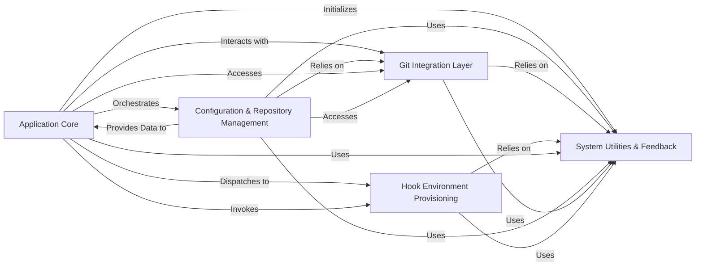

## Component Details

The `pre-commit` architecture can be effectively decomposed into five fundamental components, each with distinct responsibilities and clear interactions, ensuring modularity, maintainability, and robust operation.

### Application Core

The central orchestrator and command dispatcher for the `pre-commit` command-line interface. It handles argument parsing, sets up the application environment, and directs control to specific sub-commands for execution, acting as the primary control flow manager.

**Related Classes/Methods**:

- <a href="https://github.com/pre-commit/pre-commit/blob/master/pre_commit/main.py#L196-L437" target="_blank" rel="noopener noreferrer">`pre_commit.main` (196:437)</a>

- `pre_commit.commands` (1:1)

### Configuration & Repository Management

Manages the application's configuration by parsing, validating, and potentially rewriting the `.pre-commit-config.yaml` file. It also handles the local cache of pre-commit repositories, including cloning, metadata storage, and lifecycle management (e.g., garbage collection).

**Related Classes/Methods**:

- <a href="https://github.com/pre-commit/pre-commit/blob/master/pre_commit/clientlib.py#L1-L1" target="_blank" rel="noopener noreferrer">`pre_commit.clientlib` (1:1)</a>

- <a href="https://github.com/pre-commit/pre-commit/blob/master/pre_commit/yaml.py#L1-L1" target="_blank" rel="noopener noreferrer">`pre_commit.yaml` (1:1)</a>

- <a href="https://github.com/pre-commit/pre-commit/blob/master/pre_commit/yaml_rewrite.py#L1-L1" target="_blank" rel="noopener noreferrer">`pre_commit.yaml_rewrite` (1:1)</a>

- <a href="https://github.com/pre-commit/pre-commit/blob/master/pre_commit/store.py#L1-L1" target="_blank" rel="noopener noreferrer">`pre_commit.store` (1:1)</a>

### Git Integration Layer

Provides a high-level interface for interacting with the Git version control system. This includes retrieving repository information (root, git dir), listing files (staged, changed, all), checking for merge conflicts, and managing the Git index to ensure hooks run against the correct set of files.

**Related Classes/Methods**:

- <a href="https://github.com/pre-commit/pre-commit/blob/master/pre_commit/git.py#L1-L1" target="_blank" rel="noopener noreferrer">`pre_commit.git` (1:1)</a>

- <a href="https://github.com/pre-commit/pre-commit/blob/master/pre_commit/staged_files_only.py#L107-L112" target="_blank" rel="noopener noreferrer">`pre_commit.staged_files_only` (107:112)</a>

### Hook Environment Provisioning

Responsible for setting up and managing isolated execution environments for different programming languages (e.g., Python, Node.js, Ruby, Go, Docker). It handles environment variable manipulation and executable path resolution to ensure hooks run correctly and in isolation, regardless of the user's system setup.

**Related Classes/Methods**:

- `pre_commit.languages` (1:1)

- <a href="https://github.com/pre-commit/pre-commit/blob/master/pre_commit/lang_base.py#L1-L1" target="_blank" rel="noopener noreferrer">`pre_commit.lang_base` (1:1)</a>

- <a href="https://github.com/pre-commit/pre-commit/blob/master/pre_commit/envcontext.py#L32-L61" target="_blank" rel="noopener noreferrer">`pre_commit.envcontext` (32:61)</a>

- <a href="https://github.com/pre-commit/pre-commit/blob/master/pre_commit/parse_shebang.py#L1-L1" target="_blank" rel="noopener noreferrer">`pre_commit.parse_shebang` (1:1)</a>

### System Utilities & Feedback

A foundational component providing general-purpose helper functions for common operations (e.g., executing shell commands, file system manipulations, argument partitioning). It also manages all console output, integrates with Python's logging system, and provides a centralized mechanism for catching, logging, and ensuring the application exits with an appropriate status code.

**Related Classes/Methods**:

- <a href="https://github.com/pre-commit/pre-commit/blob/master/pre_commit/util.py#L1-L1" target="_blank" rel="noopener noreferrer">`pre_commit.util` (1:1)</a>

- <a href="https://github.com/pre-commit/pre-commit/blob/master/pre_commit/xargs.py#L130-L183" target="_blank" rel="noopener noreferrer">`pre_commit.xargs` (130:183)</a>

- <a href="https://github.com/pre-commit/pre-commit/blob/master/pre_commit/output.py#L1-L1" target="_blank" rel="noopener noreferrer">`pre_commit.output` (1:1)</a>

- <a href="https://github.com/pre-commit/pre-commit/blob/master/pre_commit/logging_handler.py#L34-L41" target="_blank" rel="noopener noreferrer">`pre_commit.logging_handler` (34:41)</a>

- <a href="https://github.com/pre-commit/pre-commit/blob/master/pre_commit/color.py#L1-L1" target="_blank" rel="noopener noreferrer">`pre_commit.color` (1:1)</a>

- <a href="https://github.com/pre-commit/pre-commit/blob/master/pre_commit/error_handler.py#L70-L80" target="_blank" rel="noopener noreferrer">`pre_commit.error_handler` (70:80)</a>

- <a href="https://github.com/pre-commit/pre-commit/blob/master/pre_commit/errors.py#L1-L1" target="_blank" rel="noopener noreferrer">`pre_commit.errors` (1:1)</a>

### [FAQ](https://github.com/CodeBoarding/GeneratedOnBoardings/tree/main?tab=readme-ov-file#faq)